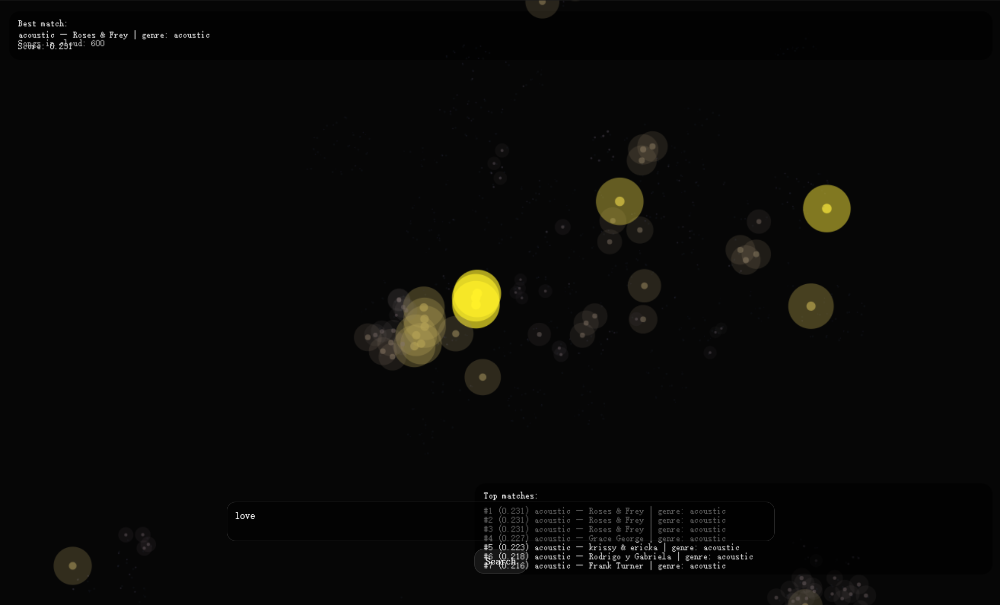

# lyricstar
Find similar songs.
# Song Nebula

An interactive nebula of songs generated using AI embeddings and UMAP projection.

Each point represents a song in semantic space. Similar songs cluster together, forming a galaxy-like structure. Users can explore this space, search by mood or concept, and navigate through musical relationships.

## Features

- AI-based semantic embedding using Transformers.js  
- Interactive nebula-style visualization  
- Search to highlight and zoom into similar songs  
- Mouse wheel zoom and hover interaction  
- Responsive full-screen canvas  

## Tech Stack

- p5.js  
- Transformers.js  
- JavaScript
